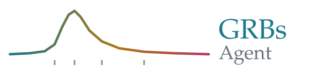
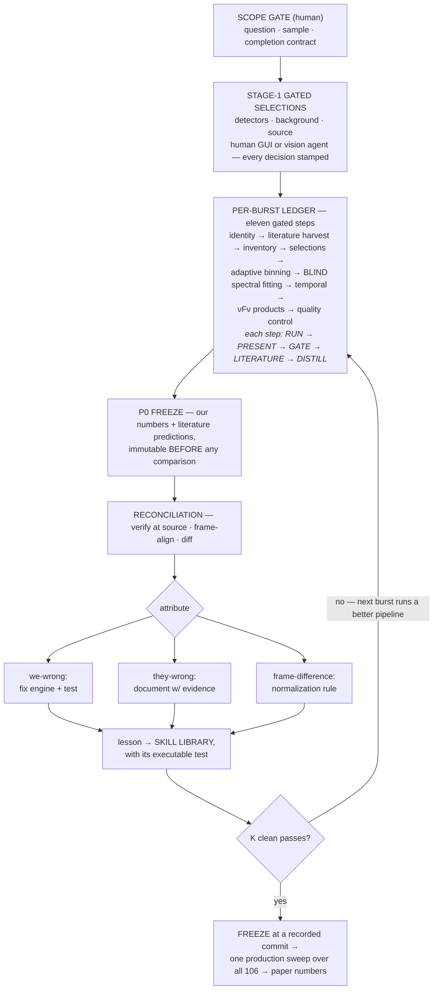
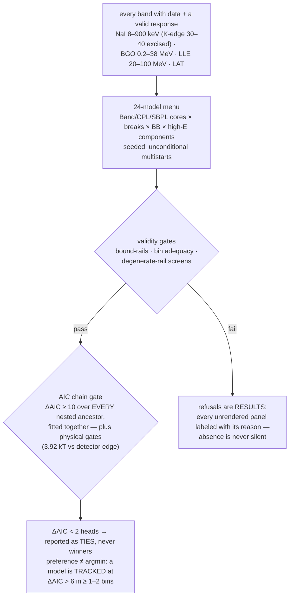
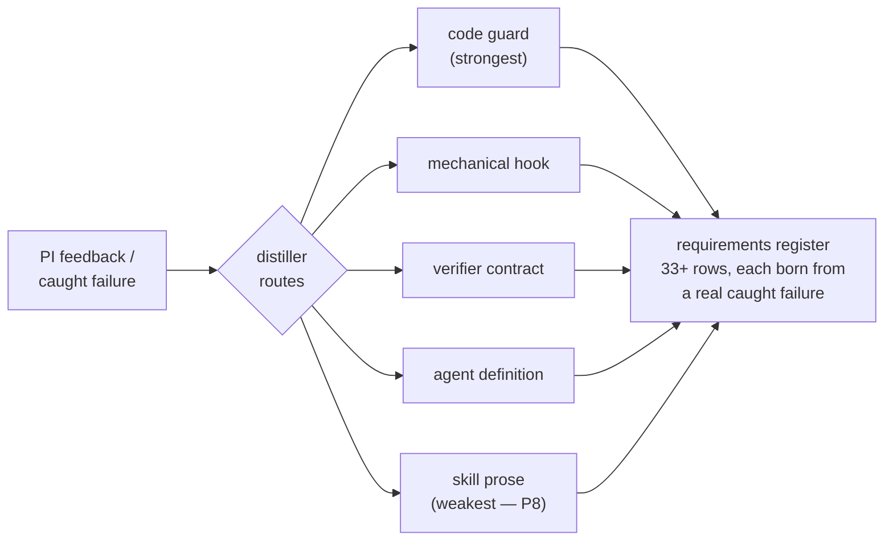
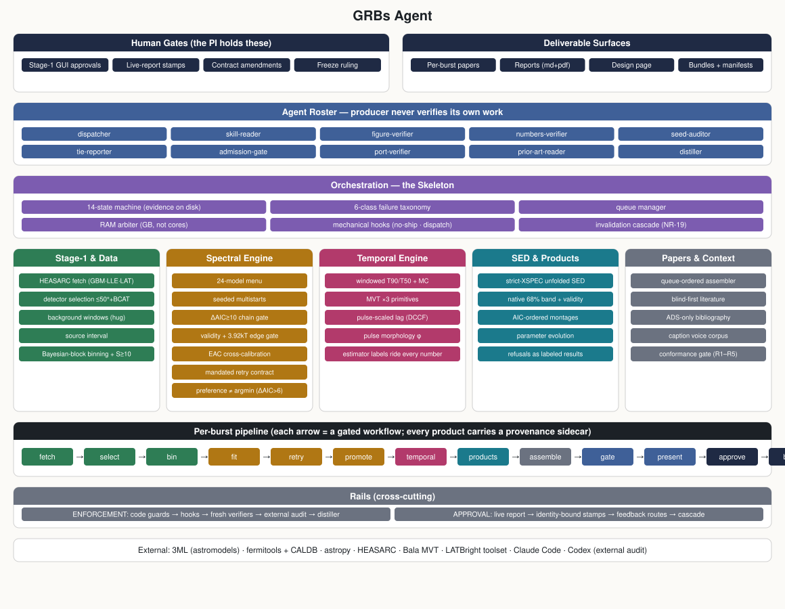
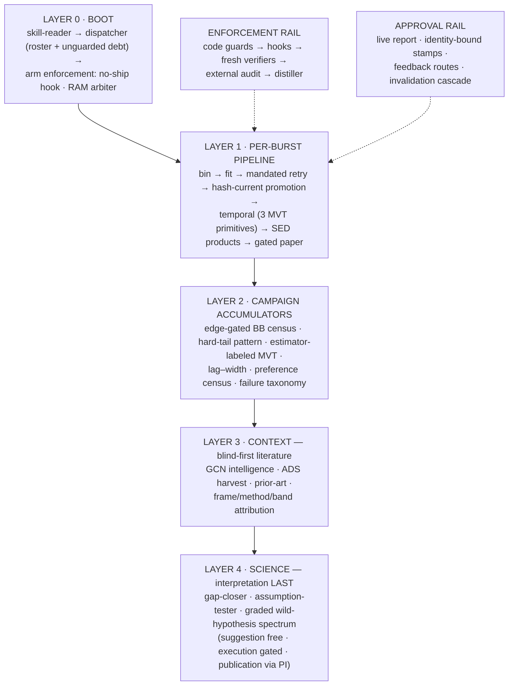
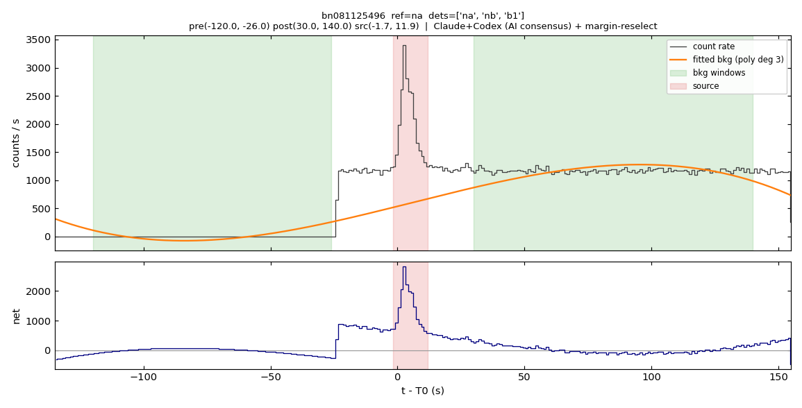
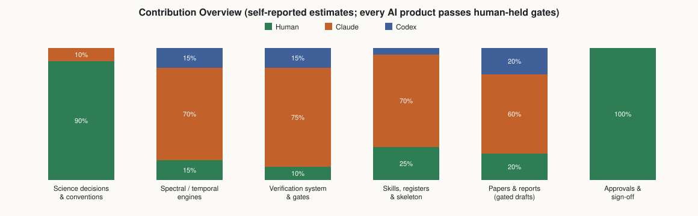

<p align="center">
  
</p>

<p align="center">
  
  
  
  
  
</p>

<p align="center">
  <b><a href="AGENTS.md">Operating Manual</a></b> ·
  <b><a href="docs/GRB_AGENT_FLOWCHART.md">Operating Design</a></b> ·
  <b><a href="dev/ai_guides/AgentSkeleton.md">The Skeleton</a></b>
</p>

**GRBs Agent** is an AI analysis agent for gamma-ray bursts: given a burst, it
acquires the *Fermi* GBM/LLE/LAT data, makes (or adopts) the detector,
background, and source selections, bins the light curve with Bayesian blocks,
fits **24 photon models to every time bin**, measures the temporal properties
with three independent minimum-variability primitives, renders the spectral
energy distributions, reconciles everything against the published literature
*blind-first*, and assembles a gated, referee-style paper per burst — while a
human (or an independent AI approver) holds every gate.

It is built on one experimentally-earned axiom: **an agent must never verify
its own work.** Every figure, number, and claim passes fresh-context
verification before a human sees it, and every failure the agent commits is
distilled — same session — into an enforcement layer (a code guard, a hook, a
verifier contract) so that failure class cannot recur silently. The agent's
two products are therefore inseparable: the **science** (a uniform survey of
106 bright single-pulse GRBs) and the **measured record of what it takes to
make an AI do supervised science** — a failure taxonomy, a catch-ledger, and
a requirements register grown entirely under load.

> **Research preview.** All numbers are provisional until the campaign
> freeze; the PI gates every deliverable. Only the frozen production sweep
> produces citable numbers.

---

## Quick look

The whole campaign is a **state machine with evidence on disk** — ask it
where every burst stands:

```console
$ python3 dev/agent_state.py
CAMPAIGN BOARD — 106 bursts
  S2_BINNED                  1   bn160625945
  S3_FIT                    74   bn090620400 bn090719063 ...
  S4_RETRIED                25   bn081125496 bn081222204 ...
  S5_PROMOTED                2   bn100707032 bn101225377
  S6_TEMPORAL_DONE           1   bn081224887
  S7_PRODUCTS_DONE           2   bn091209001 bn110618366
  SX_STRUCTURAL_EXCLUSION    1   bn100130729   ← RESPONSE_UNCOVERED, reasoned
```

Approve a step, or send it back — feedback *must* route to an enforcement
layer, and un-doing an approval mechanically invalidates everything built on
it:

```console
$ python3 dev/live_report.py --trig bn081222204 --approve 7 --by VIKAS
$ python3 dev/live_report.py --trig bn081222204 --feedback-only 7 --by VIKAS \
    --feedback "quote the window systematic alongside the statistical error"
FEEDBACK RECORDED — now route it (distiller, same session)
!! NR-19: steps 8 were approved on the OLD step-7 state.
$ python3 dev/invalidate_downstream.py --trig bn081222204 --from-step 7 --execute
   demote approval: step 8 -> STALE (was APPROVED on old state)
```

## Usage — three ways

- **Walkthrough session** — the gated per-burst protocol
  (`dev/ai_guides/BurstWalkthrough.md`): the agent runs a step, PRESENTS the
  evidence, and STOPS at your gate. The mode for discovery and review.
- **Autonomous chain** — the queue runs bursts through the skeleton's
  workflows unattended; every product still passes its verifiers, and
  approvals wait for you in the live report. The mode for campaigns.
- **Board & stamps CLI** — `dev/agent_state.py` (where is everything),
  `dev/live_report.py` (approve / feed back), `dev/invalidate_downstream.py`
  (propagate a changed decision). The mode for supervision.

<details>
<summary><b>Environment setup</b> (click to expand)</summary>

```bash
conda activate threeML            # 3ML + fermitools environment
export FERMI_DIR=$CONDA_PREFIX/share/fermitools
export CALDB=$FERMI_DIR/data/caldb   # + CALDBCONFIG/CALDBALIAS/CALDBROOT
# run from the repo root; AGENTS.md carries full setup, data acquisition,
# and the gotchas.
```
</details>

## Table of contents

- [How it works: the campaign loop](#how-it-works-the-campaign-loop)
- [Inside the fitting step](#inside-the-fitting-step)
- [The verification doctrine](#the-verification-doctrine)
- [The failure taxonomy](#the-failure-taxonomy--why-it-stopped-surprising-us)
- [Learning without gradients](#learning-without-gradients)
- [Architecture](#architecture)
- [The science](#the-science)
- [Running it](#running-it)
- [Validation](#validation)
- [Roadmap · Contributing · Authors](#roadmap)

## How it works: the campaign loop

Humans hold four things: the scope gate, every step gate, lesson acceptance,
and the freeze. The agent operates inside the ledger. The loop's product is a
**matured skill library** — every burst runs a better pipeline than the last.



## Inside the fitting step

Inclusion is gated on **data quality, never detection significance** (which
would bias the census). Every band with data and a valid response enters the
joint fit; every model family gets unconditional multistarts; a claim of
extra structure must beat *every* simpler nested alternative, fitted together
in one run.



## The verification doctrine

Three rules, each purchased with a real incident:

1. **Blind-first.** The agent's numbers are frozen (P0) *before* any
   published value is read; mismatches are attributed — frame, method, band —
   before the word "discrepancy" is allowed.
2. **Independence lives at the primitive.** Two checks that share a primitive
   count once (two of ours once agreed and were both wrong). MVT is measured
   by three estimators that differ at the primitive; every temporal number
   carries its estimator label.
3. **The producer never approves.** Ten single-purpose agents — dispatcher,
   skill-reader, figure-verifier, numbers-verifier, seed-auditor,
   tie-reporter, admission-gate, port-verifier, prior-art-reader, distiller —
   gate every artifact class; a pre-tool hook *blocks* delivery of any figure
   whose sha256 is not in a verification ledger; independent LLM platforms
   audit at milestones, adjudicated finding-by-finding.

## The failure taxonomy — why it stopped surprising us

Every failure lands in a declared class with a declared behavior — **an error
message is never a behavior**:

| class | definition | declared behavior |
|---|---|---|
| F-TRANSIENT | environment pressure (memory, load) | HOLD + resume; never self-terminate |
| F-STRUCTURAL | the data genuinely cannot yield the value | LABEL + continue; absence always reasoned |
| F-CONTRACT | a producer violated a standing contract | STOP the burst; register row, same session |
| F-ORDER | work arrived out of declared sequence | WAIT; the queue manager reorders |
| F-SILENT | a defect discovered *after* acceptance | DEMOTE + cascade + a guard that makes it loud forever |
| F-GUARD | the checking machinery itself is wrong | fix at the primitive; re-run every gate it judged |

Behind it sits a **14-state machine per burst** (`dev/ai_guides/AgentSkeleton.md`):
every burst in exactly one evidence-backed state, demotion mechanical, and
resource use admitted in **GB against measured peak RSS** through one
machine-wide arbiter — a design purchased with a real 140 GB shutdown.

## Learning without gradients

No model weights ever change. The system learns by routing every piece of
human feedback — same session — into the strongest layer that can enforce it:



Catch-ledger across the discovery run: vision gates ≈ 55, external audits
≈ 27, PI 12, source checks 6, code screens ≈ 8 — **only 3 late-or-never**.
The registers, lessons, and contracts are all in-repo and versioned: the
learned object is inspectable text, not opaque weights.

## Architecture

The full capability inventory — interfaces at the top, the engine at the
bottom, the rails crossing everything:

<p align="center"></p>

The five layers as a flow:



## The science

The survey question: across 106 bright single-pulse *Fermi*/GBM bursts, in
every resolved time bin, **what spectral shape actually wins when everything
competes** — and is the curvature beyond one break a subdominant thermal
photosphere or a second synchrotron break? Alongside: a census of synchrotron
line-of-death crossings as a property of the *rise* rather than the burst,
estimator-dependence of the minimum variability timescale, pulse-scaled
spectral lags, and thermal candidates filtered through a physical edge gate.
An example gated Stage-1 product (detector geometry, background windows,
source interval — every choice stamped):

<p align="center">
  
</p>

## Running it

Requires the [3ML](https://threeml.readthedocs.io/) + fermitools conda
environment and *Fermi* CALDB; runs from the repo root. **Start at
[`AGENTS.md`](AGENTS.md)** — the canonical operating manual (environment,
data acquisition, stage order, approval gates, products, gotchas). The
per-burst TTE data tree (~120 GB) is fetched from HEASARC by the acquisition
scripts and is not distributed here.

```text
AGENTS.md                      ← the operating manual — start here
dev/ai_guides/                 ← 25 skill files: protocols, gates, registries, the skeleton
.claude/agents/                ← the 10 agent definitions (markdown = system prompt)
.claude/hooks/                 ← mechanical enforcement (no-ship, dispatch guard)
scripts/                       ← 50+ pipeline producers (fit engine, binning, SED, temporal, reports)
results/campaign/burst_state/  ← the live evidence-backed campaign board
results/campaign/*.ecsv        ← cross-burst accumulators
```

## Validation

Three tiers, receipts in-repo:

1. **Per-artifact gates** — every figure and number passes fresh-context
   verification; verdicts sha256-bound in each burst's `VISION_QC.md`.
2. **Cross-platform adversarial audits** — independent LLM systems review
   whole subsystems against written briefs; verdicts adjudicated at the
   primitive (briefs + full reports in `notes/CODEX_*`).
3. **Blind-first reconciliation** — frozen predictions diffed against the
   published literature, mismatch-by-mismatch.

The agent's own infrastructure passes the same gauntlet: its memory arbiter
was audited by an independent multi-agent review that found two real bugs and
a broken invariant — fixed, then *re-verified by kill-testing*, which found a
deeper flaw the review itself had missed. None of it was caught by the
failing agent itself. That sentence is the design.

## Contribution overview

Who built what — and where the human hand stays mandatory:

<p align="center"></p>

## Roadmap

Skeleton freeze (state machine + saved workflows) → the campaign runs frozen
→ open release: Zenodo DOI, fetch-one-burst demo, and an issue-driven
failure-report loop where the community's caught failures feed the same
register that built the agent.

## Contributing

Issues are the channel, and **failure reports are first-class
contributions**. Three kinds, three destinations: a run failure (→ code fix +
regression test), a scientific disagreement with a convention (→ the
assumption/gap registries — these are the most valuable), a method request
(→ the science menu). See `dev/ai_guides/PI_REVIEW_PROTOCOL.md` for how
feedback becomes enforcement. Private questions: Vikas Chand —
vikas.chand.physics@gmail.com.

## Authors

**Vikas Chand** (LSU) — PI · **Khushboo Sharma** (ARIES) — replication arm ·
**Jagdish C. Joshi** (ARIES) · Agentic engineering: Claude (Anthropic), under
PI gates. Two papers in preparation: the science survey (Sharma et al.) and
the agentic-methods paper (Chand et al.); citation via Zenodo DOI on release.

## Citation

Until the Zenodo DOI lands with the open release, cite the two papers in
preparation (Sharma et al., the science survey; Chand et al., the agentic
methods). BibTeX will appear here ADS-exported, per project rule — hand-written
entries are forbidden in this repo.

## License

MIT. *The previous science-survey README is preserved in git history.*
