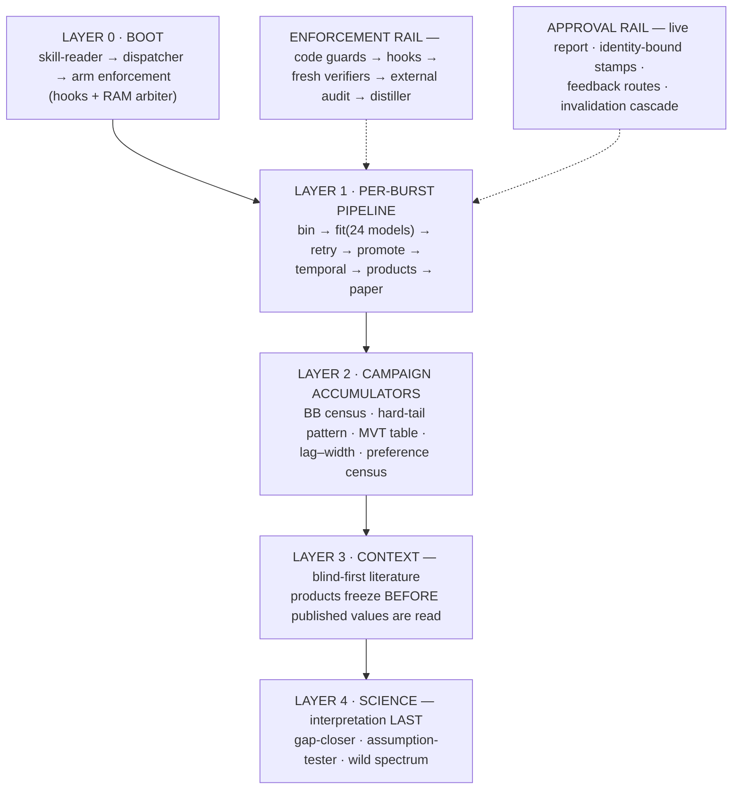

<p align="center">
  
</p>

<p align="center">
  
  
  
  
  
</p>

**GRBs Agent** is an agentic pipeline that analyzes gamma-ray bursts the way a
careful graduate student would — and, unlike one, is architecturally forbidden
from grading its own work. Every figure, number, and paper it produces passes
independent fresh-context verification before a human ever sees it; every
failure it commits is distilled into an enforcement layer so the same class
cannot recur silently. It is simultaneously a science instrument (a uniform
time-resolved spectral + temporal survey of **106 bright single-pulse
Fermi/GBM bursts**, 24 photon models per spectrum) and a measured experiment
in whether AI agents can do supervised science at all.

> **Research preview.** All numbers are provisional until the campaign freeze;
> the PI gates every deliverable. The failure taxonomy below is not a
> disclaimer — it is a primary result.

---

## The design in one figure



Full operating design: [`docs/GRB_AGENT_FLOWCHART.md`](docs/GRB_AGENT_FLOWCHART.md) ·
frozen skeleton: [`dev/ai_guides/AgentSkeleton.md`](dev/ai_guides/AgentSkeleton.md)

## What makes it an *agent* and not a script

- **A 14-state machine per burst** — every burst is in exactly one
  evidence-backed state (`results/campaign/burst_state/`); "I think it ran"
  is not a state, and demotion on invalidation is mechanical, not remembered.
- **A six-class failure taxonomy** with declared behaviors
  (HOLD / LABEL / STOP / WAIT / DEMOTE / FIX-THE-GUARD) — an error message is
  never a behavior. Silent defects discovered after acceptance are a named
  class, not a surprise.
- **Producer never verifies its own work.** Ten single-purpose agents
  (dispatcher, skill-reader, figure-verifier, numbers-verifier, seed-auditor,
  tie-reporter, admission-gate, port-verifier, prior-art-reader, distiller)
  gate every artifact class; external audits (independent LLM platforms)
  review at milestones.
- **A requirements register grown under load** — 33+ rows, each born from a
  real caught failure, each becoming a coded guard. The catch-ledger across
  the discovery run: vision gate ≈55, external audit ≈27, PI 12, source
  checks 6, code screens ≈8 — only 3 late-or-never catches.
- **Mechanical enforcement where it counts**: un-verified figures are
  *blocked* from delivery by a pre-tool hook; heavy jobs admit in **GB against
  measured peak RSS** through one machine-wide arbiter (born from a real
  140 GB shutdown); pipeline producers refuse to launch without a fresh
  dispatch plan.

## The science

A uniform empirical survey asking what spectral shape actually *wins* when 24
models compete in every Bayesian-block time bin of 106 single-pulse bursts —
with preference separated from argmin (ΔAIC > 6 in ≥1–2 bins to be *tracked*),
thermal candidates filtered through a physical edge gate (3.92 kT vs the
detector K-edge), and every temporal quantity carrying its estimator label
(three MVT primitives, pulse-scaled lags, windowed durations). Two papers in
preparation: the science survey (Sharma et al.) and the agentic-methods paper
(Chand et al.).

## Running it

The pipeline runs from the repo root on a machine with the
[3ML](https://threeml.readthedocs.io/) + fermitools conda environment and
Fermi CALDB (see [`AGENTS.md`](AGENTS.md) — the canonical, tool-agnostic
operating manual: environment, data acquisition, stage order, approval gates,
products, gotchas). The TTE data tree (~120 GB) is not distributed with the
repository; acquisition scripts fetch per-burst data from HEASARC.

```text
AGENTS.md                     ← start here (operating manual)
dev/ai_guides/                ← 24 skill files: step protocols, gates, registries
.claude/agents/               ← the 10 agent definitions
dev/ai_guides/AgentSkeleton.md← the frozen state machine + failure taxonomy
results/campaign/burst_state/ ← live evidence-backed campaign board
```

## Validation

Three independent verification tiers, all with receipts in-repo: per-artifact
fresh-context gates (sha-bound verdicts in each burst's `VISION_QC.md`),
cross-platform adversarial audits (briefs + full reports in `notes/CODEX_*`),
and blind-first literature reconciliation (predictions frozen before published
values are read). The agent's own infrastructure passes through the same
gauntlet: its memory arbiter was reviewed by an independent multi-agent audit
that found two real bugs and a broken invariant — all fixed and re-verified
under kill-testing. That episode is on the record because *none of it was
caught by the failing agent itself* — the load-bearing claim of the whole
design.

## Roadmap

Skeleton freeze → the 106-burst campaign runs frozen → open release with a
Zenodo DOI, a fetch-one-burst demo, and an issue-driven failure-report loop —
the community's caught failures feed the same register that built the agent.

## Contributing

Issues are the channel — and **failure reports are first-class
contributions**: a run transcript, a refusal you believe is wrong, or a
scientific disagreement with a convention each route to a different register
(bug / assumption / method) rather than a common bin. See
`dev/ai_guides/PI_REVIEW_PROTOCOL.md` for how feedback becomes enforcement.

## Authors & License

**Vikas Chand** (LSU) — PI · **Khushboo Sharma** (ARIES) — replication arm ·
**Jagdish C. Joshi** (ARIES). Agentic engineering: Claude (Anthropic) under PI
gates. MIT License.

*The previous README (science-survey era) is preserved in git history; the
survey content now lives in the papers and `AGENTS.md`.*
