# The GRB Agent — Operating Design v3 (flowchart + step discussion)

**Provenance.** Born 2026-08-15 from the burst-1 discovery run (bn081125496:
28 gate rounds, ~105 mined failure entries → 17 classes, `BURST1_LESSONS.md`),
the agent-requirements register (`AgentArchitecture.md`), and two industry
posts that supply the implementation containers: Anthropic's *dynamic
workflows* (the harness layer: scripted fan-out/verify/loop orchestration with
budgets and resume) and Google Antigravity's *custom agents* (the role layer:
file-based agent definitions whose Markdown body IS the system prompt, with
scoped tools, permission modes, and PreToolUse hooks). Supersedes
`docs/architecture_flowchart.md` (v1) for the AI-Agent-for-GRBs draft.
**Freeze plan:** bursts #1–#10 discover; at #10 this design freezes into
committed agent files + saved workflows + hooks; #11–#106 run frozen.
**v3 (2026-08-21):** dispatcher (NR-17), approval rail — live report (NR-18) +
invalidation cascade (NR-19), resource plane (NR-12 RAM arbiter; NR-13/14/15
from the 2026-08-17 shutdown post-mortem), 10 agent files in `.claude/agents/`,
register at 29 rows. Saved workflows remain the open freeze item.

---

## Master flowchart

```mermaid
flowchart TD
  subgraph BOOT["LAYER 0 — BOOT (how the agent starts)"]
    B1[Session opens] --> B2[SKILL-READER agent<br/>reads AGENTS.md, AgentArchitecture.md,<br/>position memory, REVIEW_INDEX queue]
    B2 --> B2D[DISPATCHER agent NR-17<br/>task → required roster + gate plan<br/>surfaces UNGUARDED DEBT<br/>register rows still PROPOSED]
    B2D --> B3{Mode}
    B3 -->|walkthrough| B4[Approver = PI<br/>gates are questions]
    B3 -->|fully-AI| B5[Approver = independent agent<br/>Codex/agy or fresh Claude<br/>PI receives REPORT + gate trail]
    B4 --> B6[Arm enforcement<br/>PreToolUse hook: no un-gated figure delivery ARMED<br/>catalog-write gate PROPOSED not yet armed<br/>+ RAM arbiter NR-12: admission in GB<br/>vs measured peak RSS, never cores]
    B5 --> B6
  end

  subgraph PIPE["LAYER 1 — PER-BURST PIPELINE (steps 0–9; each step = saved workflow + fixed roster)"]
    S0[Step 0–1: data + detector selection<br/>deterministic scripts + NUMBERS-VERIFIER] --> S24[Steps 2–4: Stage-1 intervals<br/>ADOPT human decisions / propose+approve]
    S24 --> S5[Step 5: Bayesian blocks + S≥10 merge<br/>code-guarded, single agent]
    S5 --> S7[Step 7: TEMPORAL suite<br/>durations, pulse fits, MVT×3 primitives, lag<br/>ledger pre-read, estimator labels mandatory]
    S7 --> S68[Steps 6+8: SPECTROSCOPY grid<br/>24 models × bins, seeded + AIC-guarded<br/>montages, tables, evolution, SEDs]
    S68 --> NOTES[NOTES REVIEWERS fan-out<br/>per-bin residual commentary + defect escalation]
    NOTES --> S9[Step 9: report + paper assembly<br/>ADS bib agent, caption agent, MANUSCRIPT-VERIFIER]
  end

  subgraph RAIL["ENFORCEMENT RAIL (crosses every step)"]
    G1[code guards<br/>fail closed] --- G2[FIGURE VERIFIER<br/>fresh-context, sha-bound] --- G3[NUMBERS VERIFIER<br/>sidecar-bound] --- G4[hooks<br/>block, not forbid] --- G5[EXTERNAL AUDITOR<br/>Codex ultra + cloud multi-agent<br/>review, adjudicated] --- G6[DISTILLER<br/>incident → lesson layer + register row]
  end

  subgraph APR["APPROVAL RAIL (NR-18 + NR-19, crosses every step)"]
    H1[LIVE REPORT<br/>assembled per step —<br/>links evidence, never asserts] --> H2{PI gate<br/>stamp requires<br/>approver identity}
    H2 -->|approve| H3[APPROVALS.json<br/>step stamped]
    H2 -->|feedback| H4[feedback ROUTES same session:<br/>prose rule / contract item /<br/>L-series / code / register row]
    H4 --> H5[NR-19 CASCADE<br/>downstream approvals → STALE,<br/>build markers cleared,<br/>driver regenerates]
    H5 --> H1
  end

  subgraph ACC["LAYER 2 — CAMPAIGN ACCUMULATORS"]
    A1[BB census w/ edge gate] & A2[hard-tail phase pattern] & A3[estimator-labeled MVT table] & A4[lag–width table] & A5[EAC rail census] & A6[failure-mode taxonomy]
  end

  subgraph CTX["LAYER 3 — CONTEXT (blind-first literature)"]
    C1[GCN intelligence agent] --> C4[P3 DIFF ATTRIBUTOR<br/>frame/method/band before discrepancy]
    C2[ADS harvest + Scholar<br/>cross-community channel] --> C4
    C3[PRIOR-ART READER<br/>project-family notes first] --> C4
    C4 --> C5[LITVERIFY workflow<br/>adversarial citation verification<br/>every claim bibcode-grounded]
  end

  subgraph SCI["LAYER 4 — SCIENCE (last; from results + context)"]
    Q0[SYNTHESIS agent<br/>burst + accumulators + context] --> Q1[Q1 GAP-CLOSER<br/>results × gap registry<br/>judge panel scores evidence]
    Q0 --> Q2[Q2 ASSUMPTION-TESTER<br/>results × assumption registry<br/>adversarial pairs argue/refute]
    Q0 --> Q3[Q3 WILD-HYPOTHESIS SPECTRUM<br/>generate-and-filter, graded S0→S3<br/>each with a falsifiable next step]
    Q1 & Q2 & Q3 --> OUT[SCIENCE_INTERPRETATION.md<br/>three-question summary, provisional-flagged]
    OUT --> LOOP{proposes new analysis?}
    LOOP -->|yes, gated| PIPE
  end

  BOOT --> PIPE
  PIPE --> ACC
  ACC --> CTX
  CTX --> SCI
  RAIL -.enforces.- PIPE
  APR -.gates.- PIPE
  G6 -.new register rows.-> BOOT
```

---

## Layer 0 — Boot: how the agent starts

The agent never starts by "remembering." It starts by **reading, through a
dedicated agent whose only job is reading** (P8: prose consumed structurally,
never trusted to the actor's momentum). The SKILL-READER opens `AGENTS.md`,
the architecture roster, the position memory, and the burst queue, and returns
a *binding checklist*: current burst, current step, the step's skill file, the
defect-ledger caveats that must travel with every number, and the
parameter-scaling rules for this burst (the s02c-defaults lesson: constants
tuned to one burst's pulse width do not transfer). The DISPATCHER (NR-17) then turns the task into a
roster: it classifies the artifact classes at stake, returns the required
agents in gate order, and surfaces every register row whose trigger matches
but whose guard is still PROPOSED — *unguarded debt*, named before work
starts, so the session cannot silently rely on a guard that does not exist.
Mode selection then fixes
the approver: the PI in walkthrough mode; in fully-AI mode an independent
custom agent — defined identically on Claude Code and Antigravity (`agy`),
so approval is platform-independent — that produced nothing in the burst.
Last act of boot: the hooks arm. Delivery of any **.png** figure whose sha256 is not
in a VISION_QC ledger is *blocked*, not merely forbidden (the SendUserFile hook,
armed in `.claude/settings.json`; PDFs carry their own trail). The parallel
catalog-write admission gate (NR-4) is designed but **not yet armed** — the
flowchart shows it as the next hook, not a live one. Blocking beats forbidding:
it is the only enforcement layer that never broke in the discovery run. Boot also opens the machine-wide RAM arbiter (NR-12,
`dev/ram_slots.sh`): every heavy job admits in gigabytes against measured
peak RSS, never in cores. Priced by the 2026-08-17 shutdown — five product
chains each reaching a 15 GB MVT step, ~140 GB demanded of a 64 GB machine,
12.75 h of fits lost to an end-of-run-only write.

**The rail, stress-tested on itself (2026-08-18).** The arbiter — rail
infrastructure, written and tested by its own producer — went through the
gauntlet it enforces. An external multi-agent cloud review found two real
bugs and one broken invariant in it ("one burst in MVT at a time" was not
enforced: uniquely-named lock tokens meant the mkdir mutex never contended).
Testing the *fix* found a deeper flaw the review missed: zsh defers signal
traps while a foreground child runs, and no trap runs under SIGKILL or a
machine shutdown — the exact failure the guard exists to survive. Release is
now self-healing (owner-PID reaping, verified by killing the process). The
episode is NR-13/NR-14/NR-15 and the strongest evidence yet for the design's
central claim: none of it was caught by the failing agent itself.

**The approval loop (NR-18/NR-19).** Every step's evidence lands in a
per-burst live report (`dev/live_report.py`) the moment it exists; the PI or
the independent approver stamps it there (`APPROVALS.json`; a stamp without
an approver identity is rejected, and test stamps are purged the session
they are written). Feedback must route to an enforcement layer before the
session closes; if the amended step had approved descendants, the cascade
(`dev/invalidate_downstream.py`) demotes them to STALE and clears exactly
the build markers that must regenerate — accommodation is mechanical, not
remembered.

## Layer 1 — The per-burst pipeline

Each step is a **saved workflow** (deterministic orchestration, resumable,
budgeted) with a **fixed roster** (custom-agent files whose system prompts are
the contracts). Workflow *nature* differs by step — that heterogeneity is the
design:

- **Steps 0–1 (data, detector selection).** Nature: *single producer + code
  checks*. No fan-out is earned here. NUMBERS-VERIFIER confirms angles and
  BCAT masks against the catalogs (the false-"not-checkable" lesson: whole
  pipeline-source sweep before declaring absence).
- **Steps 2–4 (Stage-1 intervals).** Nature: *classify-and-act with a human
  organ*. In walkthrough mode the recorded human selections are ADOPTED,
  never re-adjudicated (flags ARE decisions). In fully-AI mode a proposal
  agent drafts selections and the independent approver judges them on the
  same light-curve evidence — the quarantine pattern: the proposer holds no
  approval power.
- **Step 5 (binning).** Nature: *deterministic with guards*. Bayesian blocks
  + the S≥10 merge; the ×√M bridge to combined-spectrum thresholds is part of
  the step's stated method, not folklore.
- **Step 7 (temporal).** Nature: *primitive-diverse verification*. Every
  quantity is measured by estimators that differ at the primitive (MVT:
  windowed-canonical / global CWT / global Haar; lag: the validated DCCF tool
  with pulse-scaled windows; durations: windowed first-crossing with
  covariance-true MC). Estimator labels are part of the measurement; the
  ledger pre-read is mandatory; false corroboration is treated as a failure
  mode, not a comfort.
- **Steps 6+8 (spectroscopy + products).** Nature: *fan-out-and-synthesize
  with adversarial gates* — the largest harness. The 24-model × N-bin grid
  runs seeded-and-guarded (live fit must reproduce the stored solution to
  |ΔAIC| < 0.1 or the panel is refused-with-reason); band validity is
  code-gated (railed-fraction and curve-containment); montages composite only
  guard-passed panels with refusals labeled; the NOTES REVIEWERS then fan out
  per bin to write residual-structure commentary and escalate defects — the
  layer that found the L28 edge-blackbody census and the tie-hidden 30 MeV
  spread.
- **Step 9 (report + paper).** Nature: *assembly with independent
  verification*. The report regenerates from products; the paper workflow
  chains the ADS bibliography agent (hand-written BibTeX forbidden), the
  caption agent (CaptionHelper corpus voice), and the MANUSCRIPT-VERIFIER,
  which recomputes every printed number from the products (it caught a
  transposed table on its first run) and checks plot completeness against
  the staged inventory — absence disclosed, never silent.

**The enforcement rail** crosses all of it: code guards > hooks > artifact
self-caveats (on-figure notes, sidecars) > dedicated verifier agents >
external audit — the hierarchy ordered by measured reliability, with the
DISTILLER closing every incident into the correct layer and a register row.

## Layer 2 — Campaign accumulators

Each burst deposits into campaign-level state that no single burst can see:
the blackbody census (with the Wien-peak edge gate applied at ingestion), the
hard-tail phase pattern (rise/late-tail occurrences), the estimator-labeled
MVT table, the lag–width table, the EAC rail census, and the failure-mode
taxonomy itself. These accumulators are what the science layer consumes — and
what makes a 106-burst campaign more than 106 papers.

## Layer 3 — Context: putting the analysis into the field

Blind-first is the law: products freeze before published values are read.
Then four context agents run: GCN intelligence (the circular dossier), the
ADS harvest with Google Scholar as the cross-community channel (resolved back
to bibcodes before citing), the PRIOR-ART READER over the project family's own
notes (the forgotten-lag-proof lesson: we re-derived what a sibling project
had proven two weeks earlier), and the P3 DIFF ATTRIBUTOR, which classifies
every ours-vs-published mismatch as frame, method, band, or genuine before
the word "discrepancy" is permitted. Every claim that survives passes the
LITVERIFY workflow — adversarial citation verification in the pattern that
produced the Sonbas retraction memo (two of our own criticisms withdrawn
because a refuter agent read the PDF from scratch).

## Layer 4 — Science: interpretation last, and three kinds of questions

The science layer runs **last, by design**: it consumes finished, gated
results plus accumulators plus verified context — never raw enthusiasm. A
SYNTHESIS agent assembles the evidence table; then three engines run, each
with a different epistemic posture, and the summary answers three questions:

**Q1 — Does this answer a gap in the field?** Nature: *matching against a
maintained gap registry* (populated by the context layer: e.g., the lag–MVT
relation's normalization has never been tested by anyone; no published
single-pulse-selected lag–variability sample exists; the GBM∩BAT MVT
calibration set is unbuilt; no blackbody census applies an edge gate). A
judge panel scores whether our evidence actually closes, narrows, or merely
touches each matched gap — "touches" is reported as such.

**Q2 — If an assumption in GRB physics is violated, can this result test
it?** Nature: *adversarial pairs over an assumption registry* (synchrotron
line-of-death and cooling regime; single-shell curvature closure —
slope 1 with fixed normalization; Band-function universality; photosphere
ubiquity; estimator-independence of timing quantities; band-independence of
durations). For each assumption one agent argues our measurement constitutes
a test and specifies the discriminating signature; a second tries to refute
the test's validity (degeneracies, windowing, calibration). Only tests
surviving refutation enter the summary — the rest are listed as
not-yet-testable, with what would make them testable.

**Q3 — Exploratory jumps: a spectrum of wild hypotheses.** Nature:
*generate-and-filter with forced diversity, graded by wildness* — S0
(conservative reading) through S3 (deliberately wild) — each entry required
to carry a falsifiable next measurement, and the whole section explicitly
quarantined as speculation (it feeds the idea bank, never the paper's claims
without promotion through Q1/Q2). Example gradient from burst 1: S0 — the
hard tail is a rise+tail phenomenon of one evolving zone; S1 — integrated
composite components in catalogs are largely evolution artifacts,
quantifiable by our T_INT-vs-bins comparator across 106 bursts; S2 — the
low-kT blackbody population in published GBM catalogs is dominated by the
same edge-artifact class our gate removes, implying published thermal rates
are inflated and re-derivable; S3 — lag–width proportionality across the
single-pulse sample would support a geometry-dominated (curvature-only)
origin for lags, testable against the Q2 curvature closure on the same data.

**The closed loop.** The science layer may *suggest* follow-up analyses — and
in fully-AI mode, *execute* them: a surviving hypothesis compiles into a new
workflow (a new grid, a new estimator run, a new stratification of the
accumulators) that re-enters the pipeline through the same gates. Suggestion
is free; execution is gated; publication passes the PI. That is the whole
agent: curiosity with a conscience.

## Governance

Everything provisional-flagged until the campaign freeze; contracts amend
only with the PI's quoted words; register rows land same-session (the
register table stands at 33 rows — NR-1–NR-10 and NR-12–NR-23, NR-11 retired
to an operations audit, plus unnumbered — beside the 8-agent roster (NR-20…NR-23
from the 2026-08-21 Codex ultra review of this build)); the PI's
catches are, by standing rule, missing-agent debts — the design goal is to
run them to zero.
