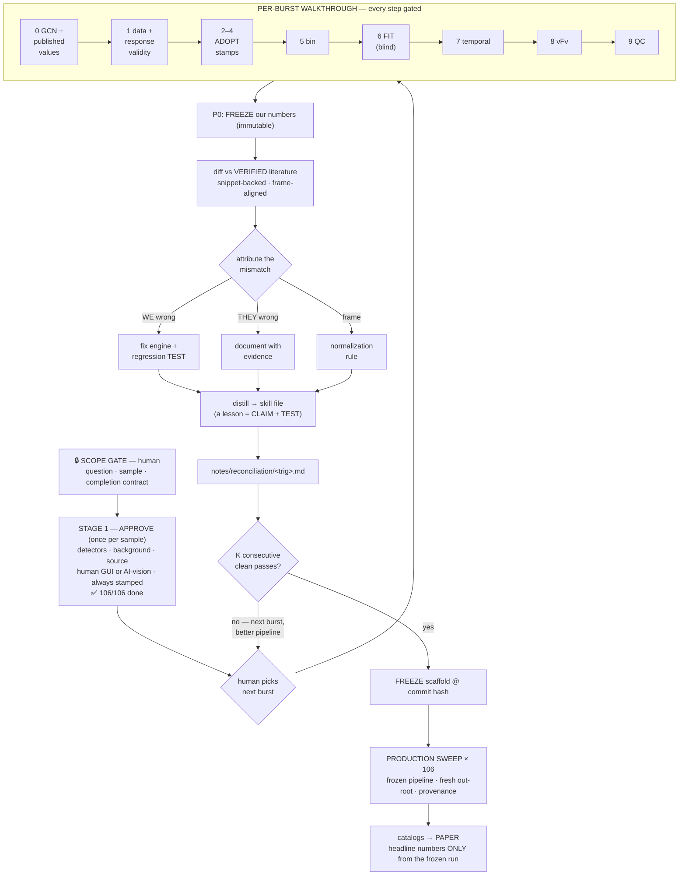
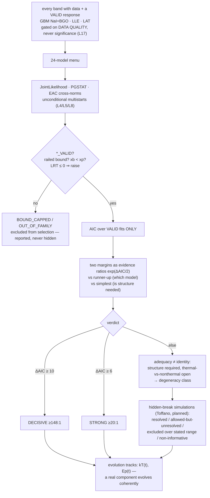

# The Agentic GRB Workflow — Consolidated Map

**Status as of 2026-08-08.** This is the single-page consolidation of everything built in
Two_Breaks, and the diagram of the agentic workflow we are developing: an AI capable of
analyzing one GRB end-to-end, or an entire scoped sample end-to-end, under human (or
simulated-human) gates. Companion to `docs/architecture_flowchart.md` (the AI-Scientist
program view); this file is the *pipeline* view.

**Vocabulary (deliberate):** most of this system is a **workflow** — predefined, gated code
paths. The **agentic** part is narrow and named in §4: bounded decisions inside the workflow,
plus a sandboxed discovery plane. We use the words precisely because the paper will.

---

## 1. What exists (built, on disk, verified)

### The engine (deterministic tools — ordinary, testable Python)

| stage | scripts | what it does |
|---|---|---|
| Sample | `01` | 106 single-pulse GRBs (Busby–Lazzati shape selection) → `results/single_pulse_grbs.ecsv` |
| Data | `02` | TTE/CSPEC/RSP2/POSHIST + LLE triplet + LAT FT1/FT2, versioned manifest |
| **Stage 1 Approve** | `00/28/30/39` | detector + background + source selection; human GUI (gtburst-mirror) **or** AI-vision; every decision stamped `APPROVED_BY/APPROVED_UTC/WINDOW_SOURCE` → `results/background_intervals.ecsv` (106/106 ✅) |
| **Stage 2 Bin** | `27b` (+`27c` LLE) | 3ML-native Bayesian Blocks + significance-merge hybrid; validated against Li & Zhang 2021 published block edges to 3 decimals |
| **Stage 3 Fit** | `29` → `10` | 24-model menu (6 base + free-n + 16 high-E composites), PGSTAT, EAC cross-norms, multistarts, `*_VALID`/`BOUND_CAPPED` gates, AIC over VALID fits, **two margins** (vs runner-up, vs simplest) as evidence ratios |
| Products | `31–38`, `41` | draft numbers, figures, machine tables, manifest, νFν panels |
| Temporal | `40_temporal_survey` | T90/T50, MVT (Haar), lag, pulse fits (Gowri two-sigmoid, φ = s_l/s_r) |
| GCN | (workflow) | per-burst dossier `results/gcn/<trig>/` with **PUBLISHED VALUES** section for the P3 diff |

### The skills layer (the actual product of the campaign)

| skill (dev/ai_guides/) | lines | ledger step | state |
|---|---|---|---|
| `BurstWalkthrough.md` | 127 | the master protocol | ✅ |
| `GCNIntelligence.md` | 95 | 0 | ✅ |
| `DataInventory.md` | 90 | 1 (D1–D3) | ✅ |
| `detector_selection.md` / `background_selection.md` / `source_selection.md` | 76/129/71 | 2–4 | ✅ (ADOPT mode) |
| `Binning.md` | 90+ | 5 | ✅ |
| `SpectralFitting.md` | 666 | 6+8 — flagship, **L1–L25**, P0–P6 reconciliation protocol | ✅ |
| `Temporal.md` | 90+ | 7 | ✅ (carries the temporal DEFECT LEDGER) |
| `qc_flagging.md` | 75 | 9 | ✅ |
| `.claude/skills/grb-two-shock-analysis/` | 11 refs | physics + hidden-break framework (Toffano) | ✅ (symlinked to `.agents/`) |

### The evidence layer

- **Reconciliation records** `notes/reconciliation/`: 160625B, 081125496, 081222204, 081224887,
  110721200, 120624933, 130310840, 130518580 + `CROSS_BURST_SYNTHESIS.md` — every published
  value snippet-backed, frames aligned, mismatches attributed.
- **Handbook** (`~/Desktop/Projects/GRB_Handbook_Project/`): Blocks 0–6 complete, 747 tests,
  typed IR, 8-link provenance spine — the portable skeleton the frozen pipeline will run on.
- **Benchmark**: 25-burst expert set (`results/benchmark/`; Expert-2 pending) + blind
  Challenge Lab design; failure taxonomy for the Sept 7 talk.

---

## 2. The campaign loop (sample end-to-end)

The loop is the point: **the per-burst numbers are not the product — the matured skills are.**
Walkthrough-era numbers are provisional by definition; nothing is quoted until the frozen sweep.

---

## 3. Inside Step 6 — the discovery loop (one burst end-to-end)

Terminal states are typed, and `non_identifiable` is a **successful** outcome — the engine must
never keep adjusting until it manufactures a preference.

---

## 4. What is agentic, exactly (and what is not)

| decided by the WORKFLOW (predefined) | decided by the AI (bounded agency) | decided by HUMANS (gates) |
|---|---|---|
| step order 0→9 | model winner via gated AIC | scope + completion contract |
| energy selections, K-edge cut | fit validity verdicts | Stage-1 approval (or delegated to AI-vision, stamped) |
| statistic (PGSTAT), EAC idiom | which literature claims are verified, frame alignment | every walkthrough step gate |
| multistart seeds, bound gates | mismatch attribution (we/they/frame) + lesson drafting | lesson acceptance; K; freeze |
| provenance stamping | anomaly flagging → discovery-plane proposals | promotion of any discovery to canon; paper claims |

**Two planes.** The production plane is the workflow above. The **discovery plane** is where
open-ended hypotheses live: anomalies spawn a sandboxed branch (hypothesis + falsifiable
prediction + calibration on simulations + validation on data that did not motivate it) and are
**promoted only through the human gate** — or archived in the negative-result ledger. Rule of
record: *the agent may invent a new scorecard after seeing the game; it may not pretend the
scorecard was chosen before the game.*

**Simulated experts.** Human judgment, distilled into skill files, applied by AI lookers to the
plots — with **independence at the primitive**: separate evidence channels (νFν image / fit
table / evolution track / adversary), never N copies of one opinion. Agreement counts only in
proportion to how deep the independence goes (the kT 52.0-vs-54.6 shared-minimum lesson).

---

## 5. Doctrine (the rules that made it work — each earned, each tested)

1. **Blind-first ordering** — Step 0 may harvest anything, including published values; the FIT
   starts blind and is never tuned toward a published number; P0 freezes before any diff.
2. **Margins over VALID fits only** — violating this caused two retracted claims.
3. **ΔAIC is an evidence ratio**, reported with both margins — never a bare verdict.
4. **Data inclusion gated on quality, never significance** (L17) — confirmed on our own data:
   LAT re-fit un-railed β on bn130310840 blk2 from −5.00 (bound) to −2.97.
5. **A lesson is not learned until it is a claim + a regression test** — the L9 fix un-railed
   blk0 and silently destroyed blk9; prose cannot fail a build, tests can.
6. **No silent approvals, ever** — every gate stamped; a skipped check is a fake pass.
7. **A published component claim is a claim about the continuum it was measured against**
   (Burgess 081224); a citation chain can be wrong (Li 2019 → Iyyani 2016); agreement can be a
   shared bad minimum. Verify at the source, attribute at the primitive.

---

## 6. Current state & open debts (2026-08-08)

| item | state |
|---|---|
| Walkthrough | #1–#6 + demo 110721A complete through the ledger; 8 reconciliation records |
| LAT re-fits (#3, #5) | ✅ done — controlled β test confirms Ravasio+2024 mechanism (blk2 β un-railed −5.00→−2.97) |
| **L9/L18 regression** (faint-block collapse) | ✅ **FIXED 2026-08-09** — simple-model multistart in `scripts/10`; demo _v2 refit recovers blk9 (α −0.927, Ep 366, VALID); same disease found+ledgered in #5 blk8 |
| **Lessons-as-tests suite** (`tests/test_lessons.py`, L11/13/16/18/19/20) | ✅ live — 28 pass, 9 xfail = the named regeneration-debt ledger |
| +BB multistart "non-determinism" claim | ✅ **REFUTED** — 5 identical runs of 130518A blk8, spread 0.000; the adversary's variance was its own invocations |
| L19 negative-LRT guard, L20 `restore_best_fit`, SHARPNESS_CAPPED, VALID plot gates | ✅ in engine (2026-08-09) |
| EPK_CURVE/WIDTH_HM in walkthrough tables | 🟡 stale (L20, systemic — 13/19 blocks in #6); regenerate before #34 quotes widths |
| T_INT BB rails at kT=1.0 despite seeds (130518A) | open — seed T_INT from flux-weighted resolved-block kT |
| T90 bootstrap (`T90_ERR > T90` in 84/89; bn130310840 row is a failed fit) | open — fix in handbook `temporal.py` |
| `Binning.md`, `Temporal.md` | ✅ written 2026-08-09 — every ledger step now has a skill |
| Reconciliation lessons **L21–L25 distilled** (frame-align checklist, continuum-relative claims, shared-bad-minimum, T_INT rail, xb≈3.92kT) + D4 | ✅ |
| Simulated-expert 4-channel experiment (bn130518580) | ✅ done — panel = good *generator*, bad *adjudicator*; one real cross-primitive corroboration (NaI cross-norm); prescribed unanimity + one confabulating channel caught |
| Expert-2 benchmark arm | pending (Khushboo) |
