# What we are building — the AI-scientist pipeline

**One line:** an autonomous "AI scientist" that analyses a gamma-ray burst the way a
competent grad student would — and *knows when it can't*. It reads **left → right** as
six layers. Two kinds of node: **🧠 agents** (an LLM making a *judgment* — the
un-scripted calls) and **⚙ steps** (a deterministic computation — the tools). The
**⚖ layers** are the judgment layers; each is wrapped by the **verify** apparatus.
Programmed, not trained — the models are interchangeable engines in the 🧠 roles.

```mermaid
%%{init: {'theme':'base','themeVariables':{'fontFamily':'Georgia, serif','fontSize':'13px','clusterBkg':'#f4f3ee','clusterBorder':'#d3d6cd','lineColor':'#8390a8','edgeLabelBackground':'#fbfaf6'}}}%%
flowchart LR
  classDef agent fill:#e6eef9,stroke:#3f6098,color:#15273e,stroke-width:1.4px;
  classDef step  fill:#e9f3e9,stroke:#3a7d3a,color:#1b481b,stroke-width:1.2px;
  classDef io    fill:#1f2a44,stroke:#0d1420,color:#ffffff,stroke-width:1px;
  classDef know  fill:#f6efe0,stroke:#c67a1e,color:#5a3d10,stroke-width:1.2px;

  IN([GRB<br/>+ raw data]):::io

  subgraph L1["① ACQUIRE"]
    direction TB
    S1[resolve identity<br/>&amp; position]:::step
    S2[download<br/>GBM · LLE · LAT]:::step
    S3[inventory<br/>+ manifest]:::step
  end
  subgraph L2["② DECIDE ⚖"]
    direction TB
    A1[🧠 detector agent<br/>geometry · occultation]:::agent
    A2[🧠 background agent<br/>pre/post + polyfit]:::agent
    A3[🧠 source agent<br/>emission interval]:::agent
  end
  subgraph L3["③ REDUCE"]
    direction TB
    S4[Bayesian Blocks<br/>+ significance merge]:::step
    S5[3ML fit ·<br/>24-model menu]:::step
    S6[AIC + physical<br/>validity gates]:::step
  end
  subgraph L4["④ JUDGE ⚖"]
    direction TB
    A4[🧠 model-select agent<br/>ΔAIC≥10 · degeneracy]:::agent
    A5[🧠 interpret agent<br/>thermal / break / cutoff]:::agent
  end
  subgraph L5["⑤ VERIFY · wraps every ⚖"]
    direction TB
    A6[🧠 proposer]:::agent
    A7[🧠 ensemble × N<br/>independent runs]:::agent
    A8[🧠 cross-family<br/>SKEPTIC refutes]:::agent
    C1[⚙ observables<br/>data · 3ML · law · repro]:::step
  end
  subgraph L6["⑥ REPORT"]
    direction TB
    A9[🧠 writer agent<br/>lit-gate + anchor linter]:::agent
    S7[provenance verifier<br/>fail-closed]:::step
  end
  OUT([verified result<br/>caveats · domain<br/>number → photon]):::io

  KB[📚 knowledge-cards<br/>+ check-library · RAG]:::know

  IN --> L1 --> L2 --> L3 --> L4 --> L5 --> L6 --> OUT
  KB -. informs .-> L2
  KB -. informs .-> L4
  L2 -. verified by .-> L5
```

## How to read it
- **🧠 agent** = an LLM making a *judgment* (the un-scripted decisions where a scientist
  differs from a button-pusher). **⚙ step** = a deterministic computation / tool.
- **① Acquire** (steps) → **② Decide ⚖** (agents: detector / background / source) →
  **③ Reduce** (steps: bin, fit, AIC) → **④ Judge ⚖** (agents: model selection,
  interpretation) → **⑤ Verify** → **⑥ Report**.
- **⑤ Verify** is the apparatus, and it wraps **every ⚖ layer** (②'s decisions and ④'s
  judgments): a **proposer**, an **ensemble** of independent runs, a **different-model
  skeptic** that tries to refute, and the **⚙ observables** (photons, 3ML likelihood,
  physical law, reproducibility) — the deterministic checks where rigor lives. Survive →
  accept with domain + caveats; fail → **flag, never fabricate**.
- **📚 Knowledge (RAG)** — literature knowledge-cards + a check-library mined from real
  papers — feeds the ⚖ agent layers.

*The models (Opus, Codex, …) are interchangeable engines that slot into the 🧠 roles —
proposer, skeptic, writer. The orchestration is what makes them a scientist.*
