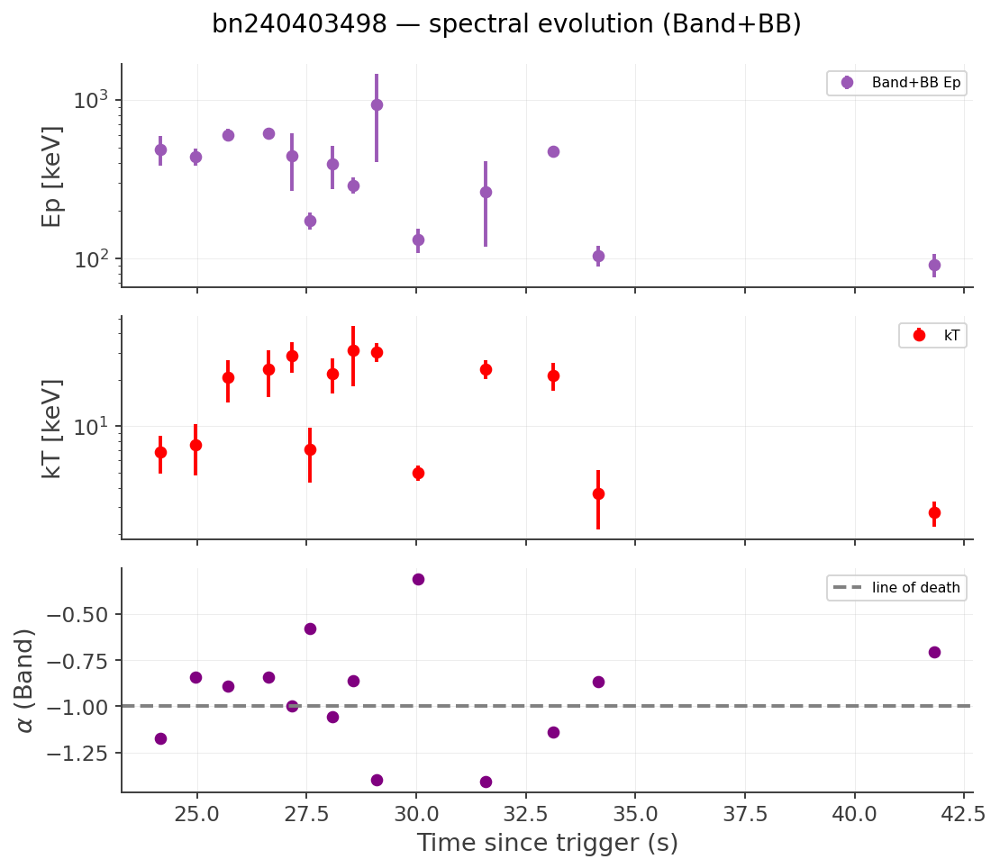
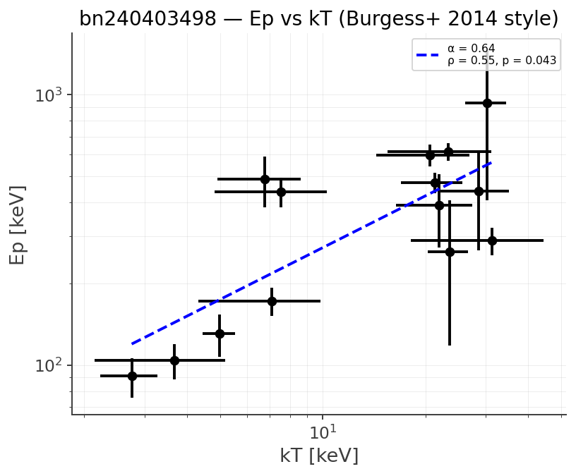
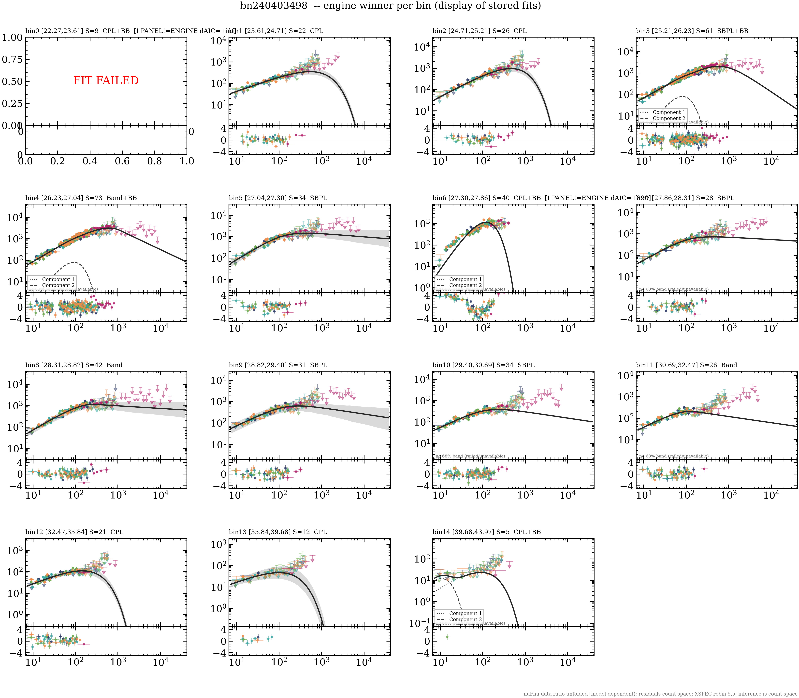

# bn240403498 — GRB 240403A

**Analysis report — generated by the gated agentic pipeline.**

- repository commit: `ed28d4c`
- products: `results/sweep106/bn240403498`
- P0 (frozen prediction) status: **none on file**
- All numbers are PROVISIONAL until the campaign is frozen and signed off.

## 1 · Identity and prior literature

**No refereed literature found for this burst** — our fits are the first published time-resolved analysis. (A burst is only 'paperless' after the recovery channels have run: dotted trigger form, local-PDF grep, citation graph, Google Scholar.)

## 2 · Data inventory and detector selection

| detector | angle (°) | background pre / post (s) | source (s) | approval |
|---|---|---|---|---|
| `n0` | 43.1 | -83.2…-8.2 / 53.8…195.8 | 18.00…48.00 | human_gui |
| `n1` | 22.6 | -86.9…-2.0 / 85.0…175.7 | 18.00…48.00 | human_gui |
| `n2` | 41.8 | -86.9…-2.0 / 85.0…175.7 | 18.00…48.00 | human_gui |
| `n5` | 35.3 | -86.9…-2.0 / 85.0…175.7 | 18.00…48.00 | human_gui |
| `b0` | 37.5 | -86.9…-2.0 / 85.0…175.7 | 18.00…48.00 | human_gui |

Detector selection, background windows and the source interval are **human decisions adopted unchanged** by the pipeline, not re-derived. Individual detectors legitimately carry different background windows.

*Step 1–2. Left: each approved detector's response (DRM) coverage against the stamped source window — a bar must bracket the window for the effective area to be valid. Right: off-axis angles against the NaI selection rule — ≤50° keep; 50–60° kept only via the BCAT rescue (the detector triggered); >60° drop. BGOs are exempt (companion rule) and appear for completeness.*

## 3 · Background and source intervals

*Step 3. Per detector: the light curve (grey) with the fitted background polynomial (colour) through the approved pre/post windows (green); the source interval is red. The diagnostic question is whether the polynomial tracks the data inside the green windows AND extrapolates sanely beneath the burst.*

*Step 4. The source window (red) inside the common background gap (green). Where the source overruns the gap the figure says so — those are ledgered, accepted human overrides, not defects.*

## 4 · Time binning

**15 blocks** from Bayesian Blocks with a significance merge; per-block significance 5–73.

Narrowest 0.25 s, widest 4.29 s — the binning adapts to the light curve rather than using a fixed cadence.

*Step 5. Net light curve (filled histogram) with the Bayesian blocks drawn as a continuous step, coloured by block significance $S$. $S$ is computed by threeML's own routine (Li \& Ma equivalent for a Gaussian background, Vianello 2018) and is ACCUMULATED over the block, so it grows with duration as well as with rate: a long dim block can legitimately outscore a short bright one. Here the 2.83 s shoulder block scores above the 0.76 s peak block for exactly that reason.*

## 5 · Time-resolved spectroscopy

Every block is fitted with the full model menu; the winner is the lowest AIC among **physically valid** fits, and evidence is reported as two margins (against the runner-up and against the best simple model).

| block | interval (s) | winner | ΔAIC vs best simple | Band α | Ep (keV) | β | thermal |
|---|---|---|---|---|---|---|---|
| T_INT | 22.27…43.97 | CPL+BB | **DECISIVE** | -1.06 | 329.7 | -2.28 | Band+BB kT=21.3 (in-band) |
| 0 | 22.27…23.61 | CPL+BB | +1.0 | -1.28 | 191.7 | -3.17 | — |
| 1 | 23.61…24.71 | CPL | -2.4 | -1.29 | 540.3 | -9.37 | — |
| 2 | 24.71…25.21 | CPL | -3.4 | -0.93 | 457.8 | -3.74 | — |
| 3 | 25.21…26.23 | SBPL+BB | +0.8 | -0.89 | 542.0 | -2.78 | — |
| 4 | 26.23…27.04 | Band+BB | +0.1 | -0.84 | 573.5 | -2.88 | — |
| 5 | 27.04…27.30 | SBPL | -2.0 | -0.76 | 248.9 | -2.00 | — |
| 6 | 27.30…27.86 | CPL+BB | STRONG | -0.70 | 178.5 | -1.93 | CPL+BB kT=25.1 (in-band) |
| 7 | 27.86…28.31 | SBPL | -0.7 | -0.88 | 231.8 | -2.01 | — |
| 8 | 28.31…28.82 | Band | -2.0 | -0.78 | 254.4 | -2.12 | — |
| 9 | 28.82…29.40 | SBPL | -0.2 | -0.99 | 214.6 | -2.08 | — |
| 10 | 29.40…30.69 | SBPL | -1.2 | -1.01 | 182.2 | -2.09 | — |
| 11 | 30.69…32.47 | Band | -0.5 | -0.94 | 127.3 | -2.29 | — |
| 12 | 32.47…35.84 | CPL | -4.0 | -1.08 | 114.7 | -2.31 | — |
| 13 | 35.84…39.68 | CPL | -3.0 | -1.21 | 91.4 | -2.59 | — |
| 14 | 39.68…43.97 | CPL+BB | +0.1 | -1.65 | 78.1 | -8.71 | — |

**Spectral evolution:** Ep runs 192 → 78 keV across the burst (hard-to-soft).

*Step 6. Fitted parameter evolution across blocks. Discontinuities that no emission mechanism could produce are the signature of a collapsed fit, not of the source.*

*Step 6. Peak energy against blackbody temperature where a thermal component is significant. Absent when no block carries one.*

*Step 8. νFν spectrum per block with the **engine's stored winning model** — the panel displays the stored fit, it does not re-decide. Any `[! PANEL!=ENGINE]` stamp means the drawn curve drifted from the table: trust the table.*

## 6 · Temporal properties

- **T90 = 13.73 ± 0.36 s** (reference detector `n1`)
- T50 = 4.36 s
- minimum variability timescale: **withheld** — the catalog MVT_* columns are STALE-PENDING-REWALK and this burst is not in `rewalked_triggers`
- spectral lag: **withheld** — the catalog LAG_* columns carry the proven sign-inverted DCCF; the validated engine (`s02c_spectral_lag`, via scripts/47c) was not available for this burst

> ⚠ **NR-31 guard active.** Any MVT or lag for this burst must come from a re-walk with the validated tools, not from `temporal_catalog_all106.ecsv`.

*Uncertainties come from Poisson realizations of the raw counts minus the fitted background, using the same estimator as the point value inside the approved window (audited 2026-08-13). Background-model uncertainty is not propagated.*

*Step 7. Cumulative net counts per energy band with t5/t95 marked. The duration shortening toward higher energy is the expected band dependence — measured here per burst rather than assumed from a population relation.*

## 7 · Quality control and honest flags

*Step 9. Top: per-block evidence for extra structure against the DECISIVE (ΔAIC ≥ 10) and STRONG (≥ 6) lines, winner labelled. Bottom: 3.92·kT for significant blackbodies against the 20 / 30 keV edge boundaries.*

No edge-constrained components, no near-threshold margins, no missing products.

## 8 · Provenance and standing caveats

- Stage-1 selections are human decisions, adopted unchanged and stamped.
- Fits are blind: the model menu and validity gates decide, never a published value.
- Winners are AIC-selected among valid fits; **adequacy is not identity** — a winning model is not a claim that the source is that model.
- The significant-blackbody rule currently counts the Band+BB and CPL+BB nested tests; other nested pairs are not yet included (open item), so thermal counts are **provisional**.
- All numbers here are provisional until the campaign is frozen and signed off.

